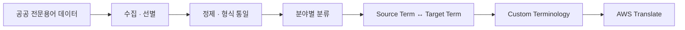
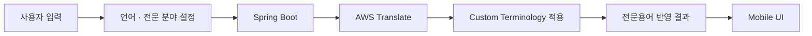
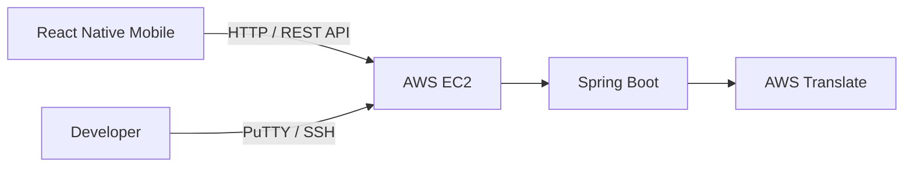
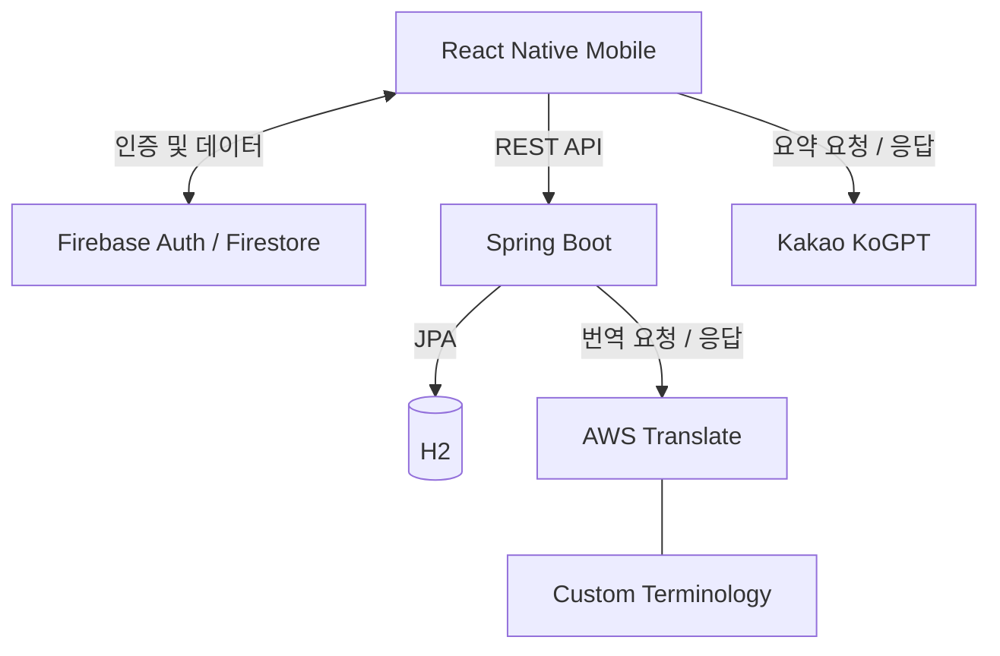

# TransMate

> **전문용어 데이터셋과 AWS Translate Custom Terminology를 활용한 비즈니스 통번역 서비스**

  

TransMate는 전남대학교 소프트웨어공학과 캡스톤디자인에서 **3인 팀으로 개발한 모바일 통번역 서비스**입니다.

비즈니스 회의에서 일반 번역이 전문용어의 맥락을 충분히 반영하지 못하는 문제에 주목했습니다. 공공 전문용어 데이터를 분야별 데이터셋으로 구축하고 **AWS Translate Custom Terminology**에 적용하여, 사용자가 선택한 전문 분야의 용어가 번역 결과에 반영되도록 구성했습니다.

항만 분야의 `AD Duty → 반덤핑관세`와 같이 실제 구축한 전문용어 데이터를 번역에 적용했으며, 번역 대화를 회의록·요약·일정으로 관리할 수 있도록 서비스를 구성했습니다.

---

## Project Overview

| 항목 | 내용 |
| --- | --- |
| **기간** | 2023.03 – 2023.06 |
| **프로젝트 유형** | 전남대학교 소프트웨어공학과 캡스톤디자인 |
| **팀 규모** | 3명 |
| **핵심 목표** | 분야별 전문용어를 반영한 비즈니스 통번역 서비스 구현 |
| **주요 결과** | 캡스톤디자인 최종 발표 · 졸업논문 |

### Team Roles

| 팀원 | 담당 영역 | 주요 역할 |
| --- | --- | --- |
| **고민주** | Data · Infrastructure · Translation | 전문용어 데이터셋 구축, AWS EC2 서버 환경 구축·배포, AWS Translate 연동 참여 |
| **[A](팀원-A-GitHub-URL)** | Mobile · Firebase | React Native Mobile UI 및 Firebase 기반 기능 구현 |
| **[B](팀원-B-GitHub-URL)** | Backend · Translation | Spring Boot REST API 및 주요 AWS Translate 기능 구현 |

---

## My Contribution

| 영역 | 담당 내용 | 기여 |
| --- | --- | --- |
| **전문용어 데이터** | 분야별 번역 데이터셋 구축 | **주도** |
| **AWS 서버 환경** | AWS EC2 인스턴스 구축, PuTTY/SSH 기반 Backend 배포·관리 | **주도** |
| **번역 기능** | AWS Translate API 및 Custom Terminology 연동 | **공동 구현 참여** |

> 공공 전문용어 데이터를 분야별 번역 데이터셋으로 구축하고 AWS EC2 기반 Backend 실행 환경을 구축·배포했으며, AWS Translate Custom Terminology 연동에 공동 참여했습니다.

---

## Core Implementation

### 1. 전문용어 데이터셋 구축

공공 전문용어 데이터에서 서비스에 필요한 데이터를 선별하고 형식을 통일한 뒤, 분야별로 분류하여 `Source Term ↔ Target Term` 형태의 번역 용어 데이터를 구축했습니다.

구축한 데이터는 AWS Translate에서 사용할 수 있는 **Custom Terminology 형식으로 변환하여 번역 과정에 적용**했습니다.

주요 작업은 다음과 같습니다.

- 공공 전문용어 데이터 수집 및 필요한 데이터 선별
- 데이터 정제 및 형식 통일
- 전문 분야 기준 데이터 분류
- `Source Term ↔ Target Term` 매핑
- AWS Custom Terminology 적용을 위한 데이터 형식 구성

> 예: 항만 분야 `AD Duty → 반덤핑관세`

---

### 2. 전문용어 기반 번역 연동

사용자는 번역 전에 **출발 언어, 도착 언어, 전문 분야**를 설정합니다.

Mobile에서 입력 텍스트와 설정값을 Backend로 전달하면, 선택한 분야에 대응하는 Custom Terminology를 AWS Translate 요청에 적용하여 전문용어가 반영된 결과를 반환하도록 구성했습니다.

Backend에서는 AWS 응답의 적용 용어를 확인하고 필요한 경우 추가 후처리를 수행합니다. 이는 **별도의 번역 모델을 학습하는 방식이 아니라, AWS Translate의 Custom Terminology를 활용하여 도메인 용어를 번역 파이프라인에 반영하는 구조**입니다.

---

### 3. AWS 서버 구축 및 서비스 연결

모바일 애플리케이션에서 Spring Boot API에 접근할 수 있도록 **AWS EC2 기반 Backend 실행 환경을 구축하고 관리**했습니다.

EC2 인스턴스를 생성하고 PuTTY/SSH를 이용해 서버에 접속하여 Backend를 배포했으며, Mobile – Backend – AWS Translate로 이어지는 서비스 연결 과정에 참여했습니다.

---

## Features

| 기능 | 설명 |
| --- | --- |
| **음성·텍스트 번역** | STT 또는 텍스트 입력을 상대방이 선택한 언어로 번역 |
| **전문용어 번역** | 선택한 분야의 Custom Terminology를 적용하여 전문용어 반영 |
| **회의록 관리** | 번역 대화를 회의 단위로 저장·조회 |
| **회의 내용 요약** | 저장된 회의 내용을 기반으로 요약 결과 제공 |
| **PDF 생성** | 회의 기록 및 요약 결과를 문서로 생성 |
| **일정 관리** | 회의 일정 등록·관리 |

---

## Screens

<table>
  <tr>
    <td align="center">
      
    </td>
    <td align="center">
      
    </td>
  </tr>
  <tr>
    <td align="center"><b>전문용어 번역</b></td>
    <td align="center"><b>회의록 관리</b></td>
  </tr>
  <tr>
    <td align="center">
      
    </td>
    <td align="center">
      
    </td>
  </tr>
  <tr>
    <td align="center"><b>일정 관리</b></td>
    <td align="center"><b>회의 내용 요약</b></td>
  </tr>
</table>

### Demo

시연 영상은 확인 후 업로드

---

## Architecture

- **Mobile**: React Native 기반 사용자 인터페이스 및 Firebase 연동
- **Backend**: Spring Boot 기반 REST API, 서비스 데이터 및 번역 요청 처리
- **Database**: H2 기반 Account·Meeting·Schedule 데이터 관리
- **Translation**: AWS Translate + Custom Terminology
- **Auth / Data**: Firebase Authentication + Firestore
- **Infrastructure**: AWS EC2

> 회의 내용 요약은 Mobile에서 Kakao KoGPT API를 직접 호출하는 구조로 구현했습니다.

---

## Tech Stack

| 영역 | 기술 |
| --- | --- |
| **Mobile** | React Native 0.71.8, React Navigation, GiftedChat |
| **Backend** | Java 17, Spring Boot 3.0.6, Spring Data JPA |
| **Database** | H2, Flyway |
| **Authentication / Data** | Firebase Authentication, Firestore |
| **Translation** | AWS Translate, Custom Terminology |
| **Infrastructure** | AWS EC2 |
| **Verification** | JUnit, Jest, ESLint |

모바일 실행 환경과 Firebase·STT 설정은 [Mobile README](mobile/README.md)에서 확인할 수 있습니다.

---

## Post-Project Improvements

2023년 캡스톤디자인 종료 후 포트폴리오로 재정리하면서 **기존 코드를 다시 분석하고 주요 기술 부채를 개선**했습니다.

| 2023 구현 | 프로젝트 이후 개선 |
| --- | --- |
| Controller 중심 처리 | Controller – Service – Repository 책임 분리 |
| 클라이언트 식별값 기반 접근 | Firebase ID Token 검증 및 Ownership 제어 |
| AWS SDK 직접 결합 | TranslationGateway – AWS Adapter 구조로 분리 |
| 최종 Schema 중심 관리 | Flyway 기반 Migration 관리 |
| 제한적인 자동화 검증 | Backend / Mobile 테스트 및 ESLint 검증 |
| 미사용 코드·Dependency 존재 | Dead Code 및 미사용 Dependency 정리 |

### Verification

| 대상 | 결과 |
| --- | --- |
| **Backend** | 55 tests passed |
| **Mobile** | 9 Jest tests passed |
| **Mobile lint** | ESLint passed |
| **Backend local profile** | H2 · Flyway 기반 startup verified |
| **Whitespace** | `git diff --check` passed |

개선 작업은 새로운 기능 추가보다 **기존 동작을 보존하면서 구조적 기술 부채를 개선하고 검증 가능성을 높이는 데 중점**을 두었습니다.

---

## What I Learned

- 공공 전문용어를 **실제 번역 서비스에서 사용할 수 있는 도메인 데이터셋으로 구축하는 과정**
- AWS Translate와 Custom Terminology를 활용해 **도메인 데이터를 외부 번역 서비스에 연결하는 방법**
- AWS EC2 환경에서 Backend를 배포하고 Mobile – Backend – 외부 서비스를 연결한 경험
- 역할이 분리된 팀에서 **Mobile ↔ Backend API 인터페이스를 조율하고 통합하는 과정**
- 완료된 프로젝트를 다시 분석하여 인증·인가, 계층 구조, 외부 의존성, DB Migration, 테스트를 개선한 경험

---

## Limitations

이 Repository는 **2023년 캡스톤디자인 프로젝트를 포트폴리오 목적으로 정리·개선한 결과물**이며, 현재 서비스 재배포나 native modernization을 목적으로 하지 않습니다.

- Mobile은 React Native 0.71.8 기반의 legacy native environment를 유지합니다.
- Android fresh build는 legacy STT dependency의 Kotlin Gradle Plugin 호환성 문제로 제한됩니다.
- STT 및 native toolchain은 원본 프로젝트의 호환성 보존을 위해 유지했습니다.
- iOS STT는 사용 중인 legacy STT package의 native 구현 한계로 별도 검증이 필요합니다.
- Firebase native configuration과 AWS·Google·Kakao 등의 실제 credential은 Repository에 포함하지 않습니다.
- 외부 Firebase·AWS·Google·Kakao 서비스의 전체 E2E는 별도 credential 환경이 필요합니다.
- Kakao KoGPT 연동은 2023년 코드에 기반한 legacy external integration으로, 현재 endpoint 운영 상태를 보장하지 않습니다.
- Android release configuration은 포트폴리오용 legacy 설정을 유지합니다.
- Custom Terminology는 직접 학습한 ML 번역 모델이 아니라 **AWS Translate의 도메인 용어집 기능**입니다.

---

## Documentation

프로젝트의 설계와 구현 근거는 상세 기술 문서에서 확인할 수 있습니다.

**TransMate Technical Case Study**

- 프로젝트 기획 및 사용자 흐름
- 시스템 아키텍처
- 전문용어 데이터셋 구축
- Custom Terminology 기반 번역 설계
- 번역 요청 및 후처리
- Backend API 및 데이터 구조
- Firebase 인증·인가
- AWS 서버 구축 및 서비스 연동
- 테스트 및 검증
- 프로젝트 이후 개선

