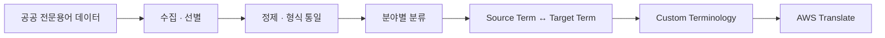
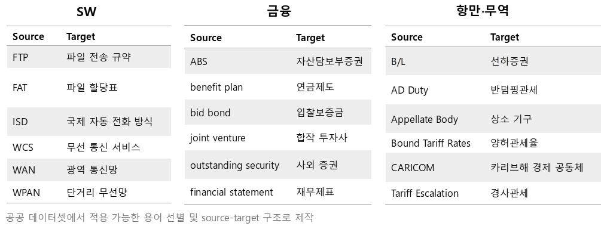
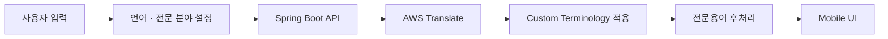
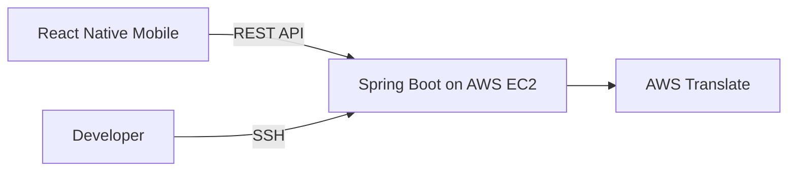

# TransMate

> 전문용어 데이터셋과 AWS Translate를 연동한 비즈니스 통번역 서비스

<table>
  <tr>
    <td align="center"></td>
    <td align="center"></td>
  </tr>
  <tr>
    <td align="center"><b>전문용어 번역</b></td>
    <td align="center"><b>회의록 관리</b></td>
  </tr>
  <tr>
    <td align="center"></td>
    <td align="center"></td>
  </tr>
  <tr>
    <td align="center"><b>일정 관리</b></td>
    <td align="center"><b>회의 내용 요약</b></td>
  </tr>
</table>

TransMate는 전남대학교 소프트웨어공학과 캡스톤디자인에서 **3인 팀으로 개발한 모바일 통번역 서비스**입니다. 일반 번역이 비즈니스 전문용어의 맥락을 충분히 반영하지 못하는 문제를 해결하기 위해 공공 전문용어 데이터를 정제하고, **SW·금융·항만/무역 3개 분야의 AWS Translate Custom Terminology**로 구축했습니다. 사용자는 분야별 전문용어가 반영된 번역 결과를 받고, 번역 대화를 회의록·요약·일정으로 관리할 수 있습니다.

---

## Project Overview

| 항목 | 내용 |
| --- | --- |
| **기간** | 2023.03 – 2023.06 |
| **유형** | 전남대학교 소프트웨어공학과 캡스톤디자인 |
| **팀 규모** | 3명 |
| **핵심 목표** | 분야별 전문용어를 반영한 비즈니스 통번역 서비스 구현 |
| **지원 분야** | SW · 금융 · 항만/무역 |
| **주요 결과** | 캡스톤디자인 최종 발표 · 졸업논문 |

### Team Roles

| 팀원 | 담당 영역 | 주요 역할 |
| --- | --- | --- |
| **고민주** | Data · Infrastructure · Translation | 전문용어 데이터셋 구축, AWS EC2 서버 구축·배포, AWS Translate 연동 참여 |
| **[황수연](https://github.com/H-sooyeon)** | Mobile · Firebase | React Native UI 및 Firebase 기반 기능 구현 |
| **[김수빈](https://github.com/sooobb)** | Backend · Translation | Spring Boot REST API 및 AWS Translate 주요 기능 구현 |

### My Contribution

| 영역 | 담당 내용 | 기여 |
| --- | --- | --- |
| **전문용어 데이터** | 공공 데이터 수집·선별·정제 및 분야별 번역 데이터셋 구축 | **주도** |
| **AWS 인프라** | EC2 인스턴스 구축, SSH 기반 백엔드 배포·관리 | **주도** |
| **번역 기능** | AWS Translate API 및 Custom Terminology 연동 | **공동 구현** |

> 전문용어 데이터셋과 AWS EC2 기반 백엔드 실행 환경의 구축·배포를 주도하고, AWS Translate 연동을 공동 구현했습니다.

---

## Core Implementation

### 1. 전문용어 데이터셋 구축

공공 전문용어 데이터에서 서비스에 필요한 용어를 선별하고 표기 형식을 통일한 뒤, **SW·금융·항만/무역** 분야로 분류했습니다. 이를 `Source Term ↔ Target Term` 구조의 AWS Custom Terminology 형식으로 변환해 번역 과정에 적용했습니다.

  

<em>SW·금융·항만/무역 분야별 전문용어 데이터셋 일부</em>

구축 데이터에는 `FTP → 파일 전송 규약`, `ABS → 자산담보부증권`, `AD Duty → 반덤핑관세` 등의 용어가 포함됩니다.

### 2. 전문용어 기반 번역 연동

사용자가 출발 언어, 도착 언어, 전문 분야를 선택하면 모바일에서 입력값을 Spring Boot API로 전달합니다. 백엔드는 선택 분야의 Custom Terminology를 AWS Translate 요청에 적용하고, 응답에 포함된 적용 용어를 기준으로 전문용어 보존을 위한 후처리를 수행합니다.

별도의 번역 모델을 학습한 것이 아니라, **도메인 용어집을 AWS Translate 번역 파이프라인에 결합한 구조**입니다.

### 3. AWS 서버 구축 및 서비스 연결

AWS EC2에 Spring Boot 백엔드를 구축하고 SSH 기반으로 배포·관리했습니다. 이를 통해 `Mobile → Backend → AWS Translate`로 이어지는 서비스 통신 환경을 구성했습니다.

---

## Features

| 기능 | 설명 |
| --- | --- |
| **음성·텍스트 번역** | STT 또는 텍스트 입력을 설정한 언어로 번역 |
| **전문용어 번역** | 선택 분야의 Custom Terminology를 적용해 전문용어를 반영 |
| **회의록 관리** | 번역 대화를 회의 단위로 저장·조회 |
| **회의 내용 요약** | 저장된 회의 내용을 Kakao KoGPT로 요약 |
| **PDF 다운로드** | 회의 기록과 요약 결과를 PDF로 생성·다운로드 |
| **일정 관리** | 회의 일정 등록·관리 |

---

## Architecture

- **Mobile**: React Native UI, Firebase 연동, STT, 회의 내용 요약
- **Backend**: Spring Boot REST API, 서비스 데이터 및 번역 요청 처리
- **Data**: Firestore 기반 모바일 데이터 및 H2 기반 Account·Meeting·Schedule 관리
- **Translation**: AWS Translate + Custom Terminology
- **Infrastructure**: AWS EC2

> 회의 내용 요약은 모바일에서 Kakao KoGPT API를 직접 호출하도록 구현했습니다.

---

## Tech Stack

| 영역 | 기술 |
| --- | --- |
| **Mobile** | React Native 0.71.8, React Navigation, GiftedChat |
| **Backend** | Java 17, Spring Boot 3.0.6, Spring Data JPA |
| **Database** | H2, Flyway, Firestore |
| **Authentication** | Firebase Authentication |
| **Translation** | AWS Translate, Custom Terminology |
| **Infrastructure** | AWS EC2 |
| **Verification** | JUnit, Jest, ESLint |

모바일 실행 환경과 Firebase·STT 설정은 [Mobile README](mobile/README.md)에서 확인할 수 있습니다.

---

## Post-Project Improvements

2023년 프로젝트 종료 후 포트폴리오로 재정리하며 기존 동작을 보존하면서 구조적 기술 부채와 검증 환경을 개선했습니다.

| 2023년 구현 | 개선 내용 |
| --- | --- |
| Controller 중심 처리 | Controller – Service – Repository 책임 분리 |
| 클라이언트 식별값 기반 접근 | Firebase ID Token 검증 및 리소스 소유권 제어 |
| AWS SDK 직접 결합 | TranslationGateway – AWS Adapter 구조로 외부 의존성 분리 |
| 최종 스키마 중심 관리 | Flyway 기반 마이그레이션 관리 |
| 제한적인 자동 검증 | 백엔드·모바일 테스트 및 ESLint 검증 추가 |
| 미사용 코드·의존성 존재 | Dead Code 및 미사용 의존성 정리 |

### Verification

| 대상 | 결과 |
| --- | --- |
| **Backend** | 55 tests passed |
| **Mobile** | 9 Jest tests passed |
| **Mobile lint** | ESLint passed |
| **Backend local profile** | H2 · Flyway 기반 startup verified |
| **Whitespace** | `git diff --check` passed |

---

## What I Learned

- 공공 전문용어를 실제 번역 서비스에 적용할 수 있는 도메인 데이터셋으로 구축한 경험
- AWS Translate와 Custom Terminology를 이용해 도메인 데이터를 외부 번역 서비스에 결합한 경험
- AWS EC2에 백엔드를 배포하고 모바일·백엔드·외부 서비스를 연결한 경험
- 팀원들과 모바일·백엔드 간 요청·응답 구조를 조율한 협업 경험
- 완료된 프로젝트를 재분석해 인증·인가, 계층 구조, 외부 의존성, DB 마이그레이션과 테스트를 개선한 경험

---

## Limitations

이 저장소는 **2023년 캡스톤디자인 프로젝트를 포트폴리오 목적으로 정리·개선한 결과물**이며, 현재 서비스 재배포나 네이티브 환경 현대화를 목적으로 하지 않습니다.

- React Native 0.71.8 기반의 레거시 네이티브 환경을 유지합니다.
- STT를 포함한 일부 네이티브 의존성은 최신 Android/iOS 도구 체인과 호환성 제약이 있습니다.
- Firebase 설정 파일과 AWS·Google·Kakao 인증 정보는 저장소에 포함하지 않습니다.
- 외부 서비스까지 포함한 E2E 검증에는 별도의 인증 정보와 실행 환경이 필요합니다.
- Kakao KoGPT 연동은 2023년 구현을 보존한 것으로, 현재 API 운영 상태를 보장하지 않습니다.
- Custom Terminology는 직접 학습한 ML 모델이 아닌 AWS Translate의 도메인 용어집 기능입니다.
