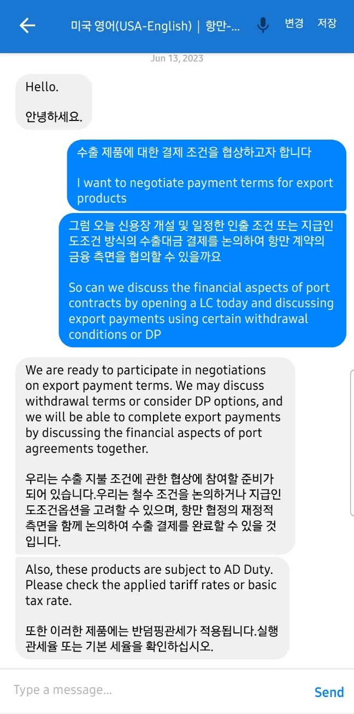
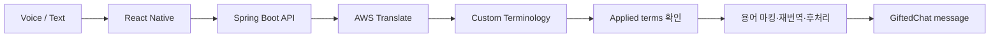
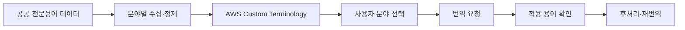
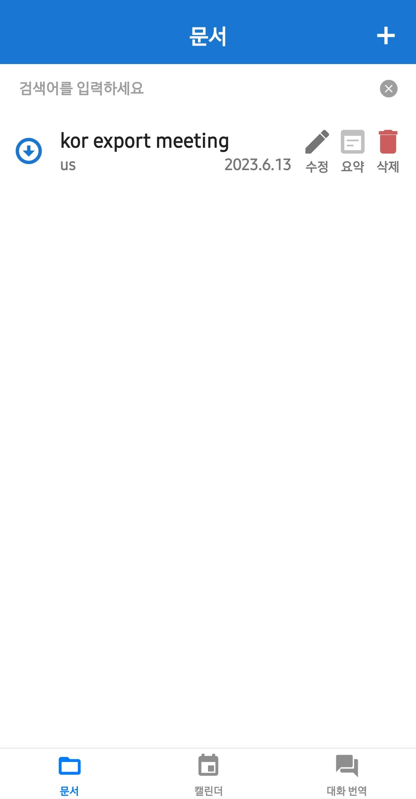
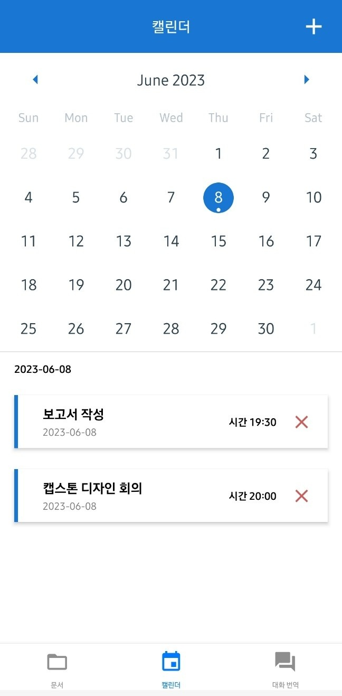
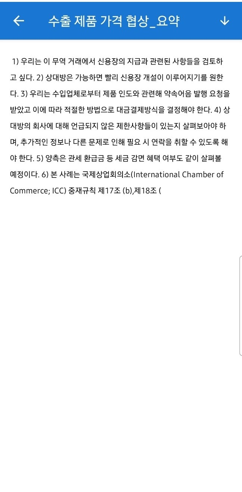
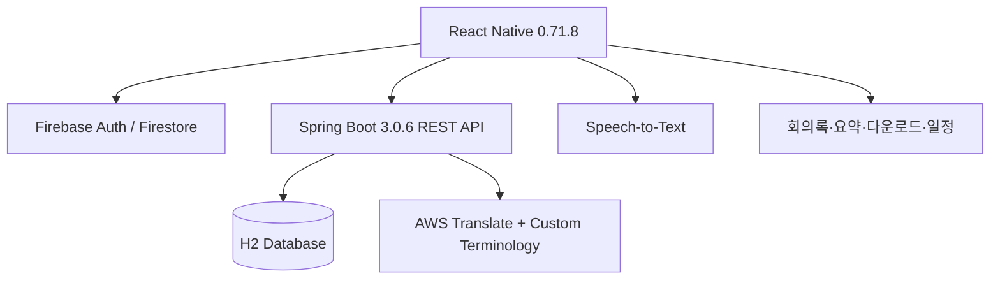
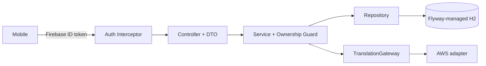

# 2023 캡스톤디자인 - 비즈니스 회의를 위한 실시간 통번역 서비스

> 비즈니스 회의의 전문용어를 일관되게 번역하고, 대화를 회의록과 일정으로 이어 주는 실시간 통번역 모바일 서비스 TransMate

  

TransMate는 2023년 대학교 4학년 캡스톤디자인으로 진행한 3인 팀 프로젝트입니다.
공공 전문용어 데이터를 분야별로 정제해 AWS Translate Custom Terminology에 적용하고,
음성·텍스트 대화부터 회의록·요약·다운로드·일정 관리까지 하나의 흐름으로 구현했습니다.
프로젝트 결과는 졸업논문과 최종보고서로 정리했습니다.

## Project Overview

| 항목 | 내용 |
| --- | --- |
| 기간 | 2023.03 - 2023.06 |
| 팀 규모 | 3명 |
| 성격 | 캡스톤디자인, 졸업논문·최종보고서 연계 프로젝트 |
| 문제 | 일반 번역에서 무역·금융 등 분야별 전문용어와 약어가 문맥에 맞지 않게 변형되는 문제 |
| 목표 | 전문분야를 선택해 용어 일관성을 높이고, 번역 대화를 회의 기록으로 연결 |

## Team & My Contribution

팀은 모바일과 백엔드를 나누어 개발했고, 번역·데이터·배포 구간을 함께 통합했습니다.
저는 백엔드, 전문용어 데이터, AWS 서버 환경을 중심으로 담당했습니다.

### 개인 담당

- 모바일 앱이 접근하는 AWS 서버 환경 구축 및 운영
- 공공 데이터를 수집·가공해 분야별 전문용어 데이터셋 제작
- 통역 페이지 흐름과 화면 설계
- 모바일 앱과 Spring Boot API 연동
- 프로젝트 통합 과정 참여

### 공동 참여

- AWS Translate Custom Terminology 적용 및 전문용어 반영 방식 구현
- Spring Boot backend와 AWS 관련 기능 개발·통합
- 팀원 간 모바일-API 인터페이스 조율

## 기존 번역과의 차별성

비즈니스 회의에서는 `L/C`, `D/P`, 반덤핑관세처럼 짧지만 의미가 명확해야 하는 용어가
반복됩니다. 일반 번역 결과가 이 용어를 문장마다 다르게 바꾸면 대화의 정확성과 기록의
신뢰도가 함께 낮아집니다. TransMate는 사용자가 전문분야를 먼저 선택하고 해당 분야의
용어집을 번역 요청에 적용해, 단순 문장 번역을 회의 맥락에 맞는 통역 경험으로 확장했습니다.

## 핵심 기능

- **전문용어 기반 실시간 번역**: 분야 선택과 Custom Terminology 적용
- **음성·텍스트 입력**: 양방향 대화를 GiftedChat UI로 표시
- **회의록 관리**: 번역 대화 저장, 검색, 수정, 삭제
- **요약·다운로드**: 회의 핵심 내용 요약과 문서 다운로드
- **일정 관리**: 날짜별 회의 일정 등록, 조회, 수정, 삭제

## Translation Flow

모바일은 원문·출발 언어·도착 언어·선택 분야의 용어집 이름을 backend에 전달합니다.
backend는 AWS 응답의 적용 용어를 확인하고, 필요한 경우 원문의 용어를 표시해 재번역한 뒤
표시 문자를 제거합니다. 이 과정은 번역 결과에서 전문용어가 다시 변형되는 경우를 줄이기
위한 후처리이며, 별도의 번역 모델을 학습하는 과정이 아닙니다.

## Custom Terminology

핵심은 ML 모델을 직접 학습한 것이 아니라, 도메인 데이터를 실제 번역 파이프라인에서
사용할 수 있는 용어집으로 만들고 AWS Translate의 Custom Terminology로 적용한 점입니다.

## 시연 영상

2023년 캡스톤디자인 당시 실제 모바일 환경에서 촬영한 시연 영상입니다.

[▶ 2023 TransMate Original Demo](docs/videos/transmate-original-demo-2023.mp4)

전문 분야가 설정된 통역 화면에서 사용자 입력을 번역하고, 전문용어가 포함된 번역 결과가
대화에 누적되는 핵심 흐름을 확인할 수 있습니다.

## 화면 자료

전문용어 번역부터 회의록·일정·요약으로 이어지는 주요 화면입니다.

<table>
  <tr>
    <td align="center"></td>
    <td align="center"></td>
  </tr>
  <tr>
    <td align="center">분야별 전문용어가 반영된 번역</td>
    <td align="center">번역 결과를 회의록으로 관리</td>
  </tr>
  <tr>
    <td align="center"></td>
    <td align="center"></td>
  </tr>
  <tr>
    <td align="center">날짜별 회의 일정 관리</td>
    <td align="center">저장된 회의 내용 요약</td>
  </tr>
</table>

## Architecture

React Native 앱, Firebase 기반 모바일 인증·실시간 데이터,
Spring Boot REST API, AWS 번역과 서버 환경을 결합한 구조였습니다.

## Tech Stack

| 영역 | 기술 |
| --- | --- |
| Mobile | React Native 0.71.8, React Navigation, GiftedChat |
| Backend | Java 17, Spring Boot 3.0.6, Spring Data JPA |
| Auth / Data | Firebase Authentication, Firestore, H2 |
| Translation | AWS Translate, AWS Custom Terminology |
| Input / Output | Speech-to-Text, text input, PDF download |
| Infrastructure | AWS server environment |

모바일 클라이언트의 실행 환경과 Firebase·Speech-to-Text 설정은
[Mobile README](mobile/README.md)에서 확인할 수 있습니다.

## 팀 프로젝트 이후 리팩토링

프로젝트의 기능과 화면은 보존하고, 이후 포트폴리오 정리 과정에서
백엔드의 구조·보안·신뢰성을 별도로 개선했습니다.

### 리팩토링 작업 목록

- Controller에 집중된 로직을 Service·Repository로 분리하고 Request·Response DTO를 도입
- Firebase ID token 검증과 인증 UID 기반의 resource ownership 검증 추가
- AWS SDK 직접 의존을 `TranslationGateway`와 AWS adapter 구조로 분리
- Flyway migration을 도입하고 불필요한 평문 password schema 제거
- validation·전역 예외 처리·번역 실패 응답·server-generated meeting ID 적용
- backend/mobile 테스트와 CI, 외부 자격 증명 없이 기동하는 local profile 추가

### Verification

| 대상 | 현재 확인 결과 |
| --- | --- |
| Backend | **55 tests passed** |
| Mobile | **9 Jest tests passed** |
| Mobile lint | **ESLint passed** |
| Backend local profile | H2·Flyway 기반 startup verified |

## What I Learned

- 외부 번역 서비스를 backend 경계 뒤에 두고 모바일과 안정적으로 연결하는 방법
- 공공 전문용어를 분야별 데이터셋과 실제 번역 용어집으로 전환하는 과정
- 모바일-backend API 계약을 팀원과 조율하고 통합하는 경험
- AWS 서버 환경을 구축·운영하며 배포와 장애 지점을 이해한 경험
- 완료된 팀 프로젝트를 다시 감사하며 인증·인가·스키마·테스트 문제를 발견하고 개선한 경험

## Limitations

- 원본 모바일은 React Native 0.71.8 기반의 legacy environment입니다.
- Firebase native configuration과 외부 credential은 repository에 포함하지 않습니다.
- 현재 포트폴리오 환경에서는 외부 서비스 E2E를 재검증하지 않았습니다.
- Custom Terminology는 직접 학습한 ML 번역 모델이 아니라 AWS Translate의 용어집 기능입니다.
- 2023년 당시 AWS 인프라 전체를 현재 환경에 재현하지 않았습니다.
