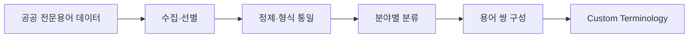
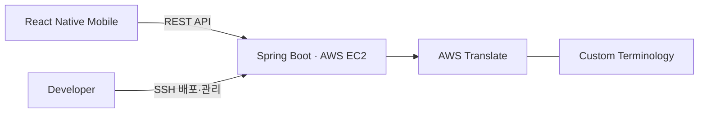
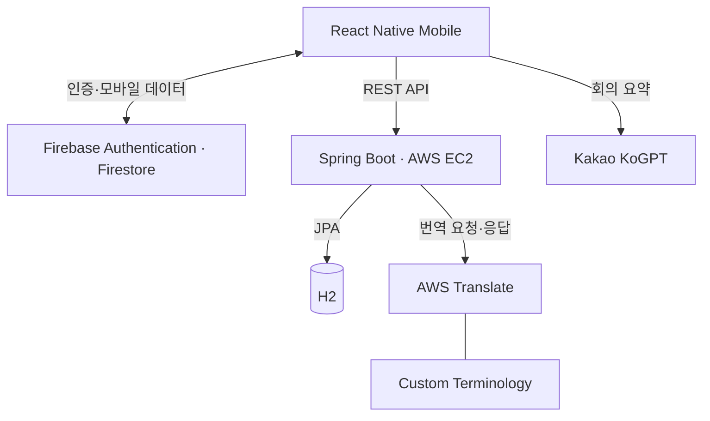

# TransMate

> 전문용어 데이터와 AWS Translate를 연동한 실시간 번역 서비스

[](https://github.com/minjuko/transmate/actions/workflows/ci.yml)

TransMate는 전남대학교 소프트웨어공학과 캡스톤디자인에서 3명이 함께 만든 모바일 번역 서비스입니다.

일반 번역이 비즈니스 전문용어의 의미를 정확하게 반영하지 못하는 문제를 해결하기 위해 공공 전문용어 데이터를 정제하고, **SW·금융·항만/무역** 분야의 AWS Translate Custom Terminology를 구축했습니다. 분야별 전문용어 번역부터 회의록·요약·일정 관리까지 하나의 서비스로 구현하고, Spring Boot 백엔드를 AWS EC2에 배포해 모바일과 외부 서비스를 연결했습니다.

저는 **전문용어 데이터셋 구축과 AWS EC2 기반 실행 환경 구성**을 주도했으며, Spring Boot API와 AWS Translate·Custom Terminology 연동에 공동 참여했습니다.

## 프로젝트 정보

| 항목 | 내용 |
| --- | --- |
| 기간 | 2023.03.02–2023.06.15 |
| 유형 | 전남대학교 소프트웨어공학과 캡스톤디자인 |
| 인원 | 3명 |
| 지원 분야 | SW · 금융 · 항만/무역 |
| 본인 역할 | 전문용어 데이터 · AWS 실행 환경 · 번역 연동(공동) |
| 결과 | 캡스톤디자인 최종 발표 · 졸업논문 |
| 배포 | 프로젝트 당시 AWS EC2에 Spring Boot 백엔드 배포 완료 |
| 현재 상태 | 공개 운영하지 않음 |

## 본인 담당 및 기여

| 영역 | 담당 내용 | 기여 |
| --- | --- | --- |
| 전문용어 데이터 | 공공 데이터 수집·선별·정제 및 분야별 번역 데이터셋 구축 | 주도 |
| AWS 인프라 | EC2 인스턴스 구성, Spring Boot 백엔드 배포·관리 | 주도 |
| 번역 기능 | AWS Translate API 및 Custom Terminology 연동 | 공동 구현 |
| 서비스 연동 | 모바일·백엔드·외부 번역 서비스 간 요청·응답 구조 조율 | 공동 구현 |

### 팀 구성

| 담당 | 주요 역할 |
| --- | --- |
| 고민주 | 전문용어 데이터셋 · AWS EC2 실행 환경 · AWS Translate 연동 공동 참여 |
| [황수연](https://github.com/H-sooyeon) | React Native UI · Firebase 기반 기능 |
| [김수빈](https://github.com/sooobb) | Spring Boot REST API · AWS Translate 기능 |

## 서비스 화면

<table>
  <tr>
    <th width="50%">전문용어 번역</th>
    <th width="50%">회의록 관리</th>
  </tr>
  <tr>
    <td align="center"></td>
    <td align="center"></td>
  </tr>
  <tr>
    <th>일정 관리</th>
    <th>회의 내용 요약</th>
  </tr>
  <tr>
    <td align="center"></td>
    <td align="center"></td>
  </tr>
</table>

## 주요 기능

| 기능 | 설명 |
| --- | --- |
| 음성·텍스트 번역 | STT 또는 텍스트로 입력한 내용을 설정한 언어로 번역 |
| 전문용어 번역 | 선택 분야의 Custom Terminology를 적용해 전문용어를 반영 |
| 회의록 관리 | 번역 대화를 회의 단위로 저장하고 조회 |
| 회의 내용 요약 | 저장된 회의 내용을 Kakao KoGPT로 요약 |
| PDF 다운로드 | 회의 기록과 요약 결과를 PDF로 생성·다운로드 |
| 일정 관리 | 회의 일정을 등록하고 관리 |

## 핵심 구현

### 1. 전문용어 데이터셋 구축

공공 전문용어 데이터에서 서비스에 필요한 용어를 선별하고 표기 형식을 통일한 뒤, **SW·금융·항만/무역** 분야로 분류했습니다.

정제한 데이터를 `Source Term ↔ Target Term` 구조로 변환해 AWS Translate의 Custom Terminology에 적용했습니다.



<p align="center">
  
</p>

<p align="center"><em>SW·금융·항만/무역 분야별 전문용어 데이터셋 일부</em></p>

구축 데이터에는 `FTP → 파일 전송 규약`, `ABS → 자산담보부증권`, `AD Duty → 반덤핑관세` 등의 용어가 포함됩니다.

### 2. AWS Translate 연동

사용자가 출발 언어, 도착 언어와 전문 분야를 선택하면 모바일에서 입력값을 Spring Boot API로 전달합니다.

백엔드는 선택한 분야의 Custom Terminology를 AWS Translate 요청에 적용하고, 응답에 포함된 용어 정보를 바탕으로 전문용어를 보존하는 후처리를 수행합니다.


Custom Terminology는 별도로 학습한 번역 모델이 아니라, AWS Translate에 적용하는 **도메인 용어집**입니다.

### 3. AWS EC2 배포 및 서비스 연결

AWS EC2 인스턴스와 보안그룹, 포트, 실행환경을 구성하고 Spring Boot 백엔드를 배포했습니다.

배포된 백엔드를 중심으로 모바일 앱과 AWS Translate를 연결해 `Mobile → Backend → Translation API` 흐름을 완성했습니다.



## 시스템 구성



- **Mobile**: React Native UI, Firebase 연동, STT, 회의록·일정·요약 기능
- **Backend**: Spring Boot REST API, 번역 요청과 Account·Meeting·Schedule 데이터 처리
- **Authentication·Data**: Firebase Authentication, Firestore
- **Translation**: AWS Translate, Custom Terminology
- **Infrastructure**: AWS EC2

회의 내용 요약은 모바일에서 Kakao KoGPT API를 호출하는 구조로 구현했습니다.

## 프로젝트 기술 스택

> 아래 기술은 프로젝트 전체 구성 기준입니다. 개인 구현 범위는 **본인 담당 및 기여** 섹션을 따릅니다.

| 영역 | 기술 |
| --- | --- |
| Mobile | React Native 0.71.8 · React Navigation · GiftedChat |
| Backend | Java 17 · Spring Boot 3.0.6 · Spring Data JPA |
| Database | H2 · Flyway · Firestore |
| Authentication | Firebase Authentication |
| Translation | AWS Translate · Custom Terminology |
| Infrastructure | AWS EC2 |
| Test·Quality | JUnit · Jest · ESLint · GitHub Actions |

모바일 실행환경과 Firebase·STT 설정은 [Mobile README](mobile/README.md)에서 확인할 수 있습니다.

## 개선 작업

프로젝트 당시 구현한 기능을 유지하면서 계층 구조, 인증·인가, 외부 서비스 의존성과 자동 검증 환경을 개선했습니다.

| 영역 | 개선 내용 |
| --- | --- |
| Backend 구조 | Controller 중심 로직을 Controller–Service–Repository 계층으로 분리 |
| 인증·인가 | Firebase ID Token 검증과 사용자 리소스 소유권 검사 적용 |
| 번역 연동 | TranslationGateway와 AWS Adapter로 외부 API 의존성 분리 |
| Database | Flyway 기반 스키마 마이그레이션 구성 |
| 예외 처리 | 입력값 검증과 공통 오류 응답 구조 정리 |
| 코드 품질 | Dead Code와 미사용 의존성 정리 |
| 자동 검증 | Backend·Mobile 테스트, ESLint와 GitHub Actions CI 구성 |

## 테스트 및 검증

2026.09.13 기준 외부 서비스 호출 없이 로컬 환경에서 검증했습니다.

| 검증 항목 | 결과 |
| --- | ---: |
| Backend tests | **55 / 55 passed** |
| Mobile test suites | **4 / 4 passed** |
| Mobile tests | **9 / 9 passed** |
| 실패·Skip | **0** |
| Mobile ESLint | **passed** |
| Backend local profile | **startup verified** |
| Flyway migrations | **3 applied** |
| Git diff check | **passed** |

Backend local profile은 AWS 인증 정보 없이 H2 인메모리 데이터베이스와 Flyway를 사용해 실행됩니다.

GitHub Actions는 Backend 테스트와 Mobile 테스트·ESLint를 독립적으로 검증합니다.

## 검증 명령

### Backend

```bash
cd backend
./gradlew clean test
```

### Mobile

```bash
cd mobile
npm ci
npm test -- --runInBand
npm run lint
```

## 현재 검증 범위

- 프로젝트 당시 핵심 기능 구현과 AWS EC2 백엔드 배포를 완료했습니다.
- 현재는 공개 서비스를 운영하거나 재배포한 상태가 아닙니다.
- 실제 Firebase 인증과 AWS Translate 호출은 별도 인증 정보가 필요해 현재 검증에 포함하지 않았습니다.
- Firebase 설정 파일과 AWS·Google·Kakao 인증 정보는 저장소에 포함하지 않습니다.
- Android·iOS Native Build와 전체 Mobile E2E는 현재 환경에서 검증하지 않았습니다.
- React Native 0.71.8 기반 의존성은 major upgrade와 Native 환경 호환성 검토가 필요해 기존 버전을 유지했습니다.
- Kakao KoGPT 연동은 프로젝트 당시 구현을 보존한 것으로, 현재 API 운영 상태는 별도 확인이 필요합니다.

## 문서

| 문서 | 내용 |
| --- | --- |
| [Mobile README](mobile/README.md) | 모바일 실행환경과 Firebase·STT 설정 |
